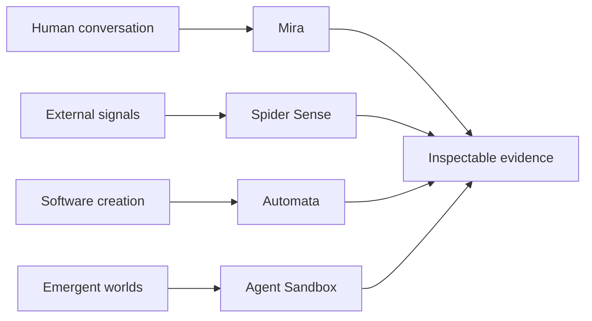

  

### Independent AI systems developer

I build deterministic, inspectable agents for conversation, coordination, research, and emergent worlds.

[Systems](#systems-in-private-development) · [Principles](#engineering-principles) · [Current focus](#current-focus) · [Start a conversation](https://github.com/Konfusi0n/Konfusi0n/discussions)

## Systems in private development

> The implementation repositories remain private. This page shares product direction and engineering principles—not source code, credentials, infrastructure, prompts, or operational configuration.

| System | Purpose | Current direction |
| --- | --- | --- |
| **Agent Sandbox** | A deterministic living world where intelligent agents grow civilizations through pressure, discovery, and culture | Emergent materials, skills, institutions, and visible construction |
| **Mira** | A Discord-native AI operations room for voice, research, memory, and creative collaboration | Trust receipts, live voice, research trails, and operator control |
| **Automata** | A precision orchestration engine for supervising autonomous coding agents | Architecture memory, scoped authority, evidence, and reliable handoffs |
| **Spider Sense** | An evidence-first research system that turns web sources into ranked, traceable intelligence | Source discovery, contradiction checks, and research synthesis |

**Mira collaborates. Agent Sandbox evolves. Automata coordinates. Spider Sense investigates.**

## How the work connects

## Engineering principles

- Simulation determines state; models propose possibilities
- Evidence should remain traceable and inspectable
- Agent authority should be explicit and bounded
- Complex behavior should emerge from composable systems
- Generated output, stored memory, and verified evidence should remain distinguishable

## Current focus

Building foundations for agents that can observe pressure, experiment, remember, teach, coordinate, and gradually create civilizational systems—while keeping authority and evidence visible.

## Contact

I am open to thoughtful conversations about agent architecture, simulation, research systems, developer tooling, and experimental AI products.

[Start a public conversation on GitHub](https://github.com/Konfusi0n/Konfusi0n/discussions)

Please do not include confidential or sensitive information in a public discussion.
