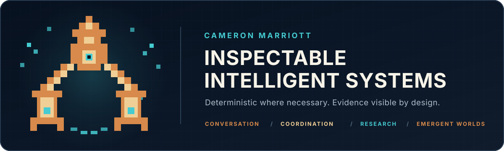
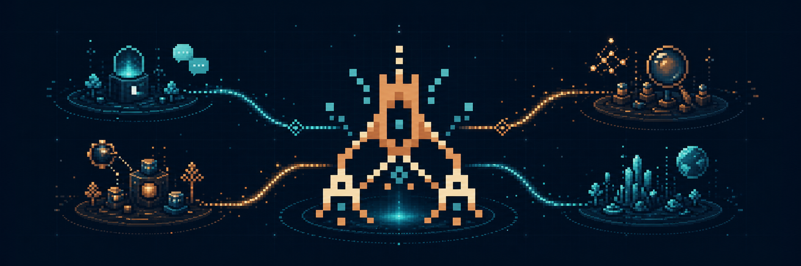
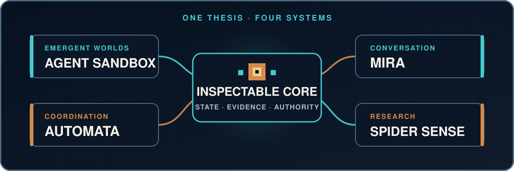

  <picture>
    <source media="(max-width: 600px)" srcset="./assets/profile-banner-mobile.svg" />
    
  </picture>

<h1 align="center">Cameron Marriott</h1>

<strong>Independent AI systems developer</strong>

  I build deterministic, inspectable agent systems for conversation, coordination, research, and emergent worlds.

  <a href="#what-im-building">Explore the systems</a> ·
  <a href="https://github.com/Konfusi0n/Konfusi0n/discussions">Start a public discussion</a>

## What I’m building

### Agent Sandbox

**Emergent worlds.** A deterministic living world where agents turn pressure, experimentation, memory, and culture into civilizational change. 
_Current focus: emergent materials, skills, institutions, visible labor, and construction._

### Mira

**Conversation.** A Discord-native AI operations room for voice, research, memory, and multimodal collaboration. 
_Current focus: live voice, evidence trails, trust receipts, creative tools, and operator control._

### Automata

**Coordination.** An orchestration system for supervising coding agents with bounded authority and durable architectural context. 
_Current focus: scoped work, evidence-backed handoffs, architecture memory, and validation loops._

### Spider Sense

**Research.** An evidence-first research system that ranks sources and keeps synthesis traceable. 
_Current focus: discovery, contradiction checks, freshness checks, and source-backed synthesis._

> **Agent Sandbox evolves. Mira collaborates. Automata coordinates. Spider Sense investigates.**
>
> **Portfolio scope:** All four systems are under private development. This profile shares their product direction and engineering principles; the implementation remains private.

  

## One design language

  <picture>
    <source media="(max-width: 600px)" srcset="./assets/system-map-mobile.svg" />
    
  </picture>

> **Models propose. Validated systems decide. Evidence remains visible.**

## Engineering principles

- **Authority is explicit** — models propose; validated systems decide what changes
- **Evidence stays inspectable** — claims, sources, decisions, and fallbacks remain traceable
- **Agency stays bounded** — permissions, costs, memory, and side effects are scoped
- **Emergence stays composable** — complexity grows from small interoperable systems
- **Knowledge boundaries stay clear** — simulation, memory, inference, generation, and verification remain distinguishable

## Building now

My current focus is **Agent Sandbox**: agents that observe pressure, experiment, remember, teach, coordinate, and turn repeated behavior into tools, institutions, culture, and infrastructure—while authoritative state remains deterministic and inspectable.

## Working stack

**Languages:** C# · TypeScript · Python 
**Frameworks:** .NET · Godot · React 
**Platforms and systems:** Discord · multi-agent architecture · deterministic simulation · evidence pipelines

## Contact

I am open to thoughtful conversations about agent architecture, simulation, research systems, developer tooling, deterministic AI, and experimental products.

**[Start a public conversation on GitHub Discussions →](https://github.com/Konfusi0n/Konfusi0n/discussions)**

Please do not include confidential or sensitive information in a public discussion.
