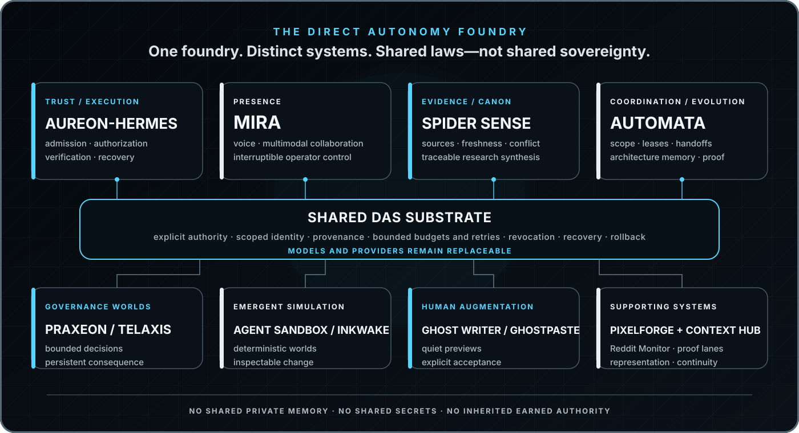

<p align="center">
  <picture>
    <source media="(max-width: 640px)" srcset="./assets/das-profile-banner-mobile.png" />
    
  </picture>
</p>

<h1 align="center">Cameron Marriott</h1>

<p align="center">
  <strong>Founder &amp; AI Systems Architect · Direct Autonomy Systems</strong>
</p>

<p align="center">
  I build bounded, persistent, evidence-aware AI systems for real work, human collaboration, research, developer coordination, and emergent worlds.
</p>

<p align="center">
  <a href="https://directautonomy.com"><strong>Website</strong></a>
  &nbsp;·&nbsp;
  <a href="mailto:founder@directautonomy.com"><strong>Email</strong></a>
  &nbsp;·&nbsp;
  <a href="https://github.com/Konfusi0n/Konfusi0n/discussions"><strong>Public Discussions</strong></a>
</p>

<p align="center">
  AI Systems Engineering · Agent Architecture · Workflow Automation · Research Systems · Developer Tooling · Deterministic Simulation
</p>

---

## Direct Autonomy Systems

**Direct Autonomy Systems (DAS)** is an independent AI systems company and R&amp;D foundry. I design agents, automation, research infrastructure, developer tools, and simulated worlds around one governing rule:

> **Models propose. Deterministic systems admit, authorize, verify, and commit.**

The aim is **delegated intelligence, not machine sovereignty**: software that can reason, remember, coordinate, and act within explicit authority while keeping evidence, uncertainty, cost, side effects, recovery, and human control visible.

DAS is not a collection of unrelated chatbot demos. Each project investigates a distinct systems problem. Proven laws, components, evaluation suites, and operating patterns can be promoted into shared infrastructure—but private memory, secrets, identity, and earned authority remain isolated.

---

## The DAS foundry

<p align="center">
  <picture>
    <source media="(max-width: 640px)" srcset="./assets/das-foundry-map-mobile.svg" />
    
  </picture>
</p>

### Core systems

<table>
  <tr>
    <td valign="top">
      <h3>Aureon-Hermes</h3>
      <strong>Trust &amp; execution.</strong> The DAS agent-runtime and control-plane foundation: explicit permissions, typed admission, bounded actions, verification, receipts, revocation, recovery, and rollback. It is where useful model proposals become—or fail to become—authorized system behavior.
    </td>
  </tr>
  <tr>
    <td valign="top">
      <h3>Mira</h3>
      <strong>Presence &amp; interaction.</strong> A Discord-native AI operations room for voice, research, memory, image and audio creation, live progress, interruption, and multimodal collaboration. Mira explores how an agent becomes responsive, understandable, and genuinely useful without becoming noisy or presumptuous.
    </td>
  </tr>
  <tr>
    <td valign="top">
      <h3>Spider Sense</h3>
      <strong>Evidence &amp; canon.</strong> A local-first investigation and evidence system for crawling, ingestion, graph reasoning, source ranking, contradiction checks, freshness, and traceable synthesis. Spider Sense helps agents know what is observed, what is claimed, what conflicts, and what remains unresolved.
    </td>
  </tr>
  <tr>
    <td valign="top">
      <h3>Automata</h3>
      <strong>Coordination &amp; evolution.</strong> A bounded coordination layer for coding agents and complex projects: work scopes, edit leases, mailboxes, architecture memory, impact analysis, handoffs, review briefs, and proof-aware operator surfaces. Improvements become reviewable candidates—not silent self-modification.
    </td>
  </tr>
</table>

> **Aureon governs action. Mira creates presence. Spider Sense grounds claims. Automata coordinates change.**

---

## Products and proving grounds

These systems test the DAS doctrine under different pressures rather than merely demonstrating the same chatbot in different skins.

- **Praxeon &amp; Telaxis — living governance worlds.** Paired Discord-native NationStates experiments that explore autonomous policy, constitutional limits, public records, persistent consequence, and the difference between optimizing outcomes and preserving legitimate authority.
- **Agent Sandbox — inspectable emergence.** A deterministic living world where pressure, experimentation, memory, teaching, trade, institutions, construction, and culture can compound into visible civilizational change without allowing generated narration to become world truth.
- **Inkwake — a simulation-first RPG oracle.** A browser-native persistent world where player language creates proposals, deterministic simulation decides what can become real, and every admitted consequence remains explainable and replayable.
- **Ghost Writer / Ghostline — writer-led continuity.** A quiet browser writing layer that offers one reversible, editor-local continuation and commits text only after explicit, current-context acceptance.
- **PixelForge — representation without authority.** A deterministic, engine-neutral visual asset compiler that turns approved semantic requests into validated, content-addressed image bundles while remaining unable to decide what exists in the world.

<details>
<summary><strong>View the complete DAS portfolio</strong></summary>
<br/>

### Agent foundations and interaction

- **Aureon-Hermes** — a DAS-hardened agent runtime built around Hermes Agent, focused on authority, execution safety, operator control, evidence, and deployment-grade proof.
- **Mira / Agentic Discord** — the Discord-native presence layer for text, live voice, research, memory, image generation, music, sound effects, progress cards, and human interruption.
- **Avarice** — an internal commercial-operations experiment for bounded lead, opportunity, and revenue-support workflows. It is not an independent financial authority.

### Evidence, context, and coordination

- **Spider Sense / RedThread** — autonomous web investigation, evidence ingestion, live graphs, GraphRAG, contradiction analysis, and source-backed synthesis.
- **Automata / Clockwork Automata** — scoped coding-agent coordination, architecture memory, work leases, mailboxes, impact analysis, proof, and an operator cockpit.
- **Context Hub / Project OS** — a continuity compiler that separates committed repository truth, safe project context, active workspace state, evidence, and handoff packets without pretending they are interchangeable.
- **Reddit Monitor** — a local-first browser sensor that turns rendered Reddit discussions into bounded, versioned observations and durable change signals; Spider Sense remains the downstream evidence authority.
- **Portfolio R&amp;D Decision Engine** — a recurring research and prioritization loop that weighs release unblock, user value, proof, differentiation, reuse, and revenue leverage against complexity, time, cost, and risk.

### Simulations and persistent worlds

- **Agent Sandbox** — deterministic agent society, physical economy, construction, institutions, precedent, governance, and inspectable emergence in C# and Godot.
- **Praxeon** — a constitutional NationStates intelligence that emphasizes citizen agency, accountable power, consequence lineage, and tamper-evident public records.
- **Telaxis** — Praxeon’s distinct sovereign-optimization counterpart: a separate identity and directive used to test how the same substrate behaves under different governing aims.
- **Inkwake** — a browser-based living ink world where prompt-driven action remains subordinate to deterministic state admission.
- **Echoes of the Veil** — an earlier deterministic simulation laboratory whose lessons feed later work in world state, causality, agents, and emergent narrative.

### Human-computer interaction and creative tooling

- **Ghost Writer / Ghostline / Continuum** — intent-aware writing continuation with editor-local previews, bounded context, strict foreground authority, and explicit Tab acceptance.
- **Ghostpaste** — a destination-aware copy-and-paste assistant built around the loop “Copy. Switch. Recognize. Tab.” with local secret gating and target-locked delivery.
- **PixelForge** — deterministic compilation, validation, lineage, and delivery of pixel-art representation for games and simulations.
- **Ghostwrite Web** — the accessible, dependency-light product surface for Ghost Writer, including interactive demonstration and deployment tooling.

### Verification and infrastructure

- **Aureon Linux-native Proof Lane** — a separate evidence-closing repository for exact Linux runtime validation. It proves a bounded subject only; it does not collapse CI, deployment, serving, or live operation into one claim.
- **DAS profile and brand system** — this public portfolio surface, company identity, and the future home for independently verified demos, case studies, and release evidence.

</details>

---

## How the portfolio compounds

The portfolio is designed to turn hard-won project lessons into reusable leverage:

```text
problem found in one system
    → bounded implementation
    → deterministic test and proof
    → reusable law, pack, or evaluation
    → proof in a second distinct system
    → client or product outcome
```

Products may inherit substrate, doctrine, tools, packs, and evaluations. They do **not** inherit private user state, secrets, identity, or trust that another system earned. A model is a replaceable capability inside the architecture—not the architecture itself.

---

## What DAS builds for clients

DAS works on problems where AI, automation, or custom software can create meaningful leverage without hiding responsibility behind a model:

- bounded AI agents with explicit tools, permissions, memory, budgets, and recovery;
- workflow automation and custom integrations across APIs, data, and human approval;
- evidence-backed research, monitoring, retrieval, and decision-support systems;
- Discord-native agents, games, simulations, and collaborative experiences;
- agent harnesses, evaluation infrastructure, context systems, and developer tooling;
- deterministic simulations and custom software where state, causality, and replay matter.

> The starting unit is not “add AI everywhere.” It is **one bounded workflow, one accountable owner, one success contract, and evidence that the system worked.**

---

## Engineering doctrine

- **Speech is not authority.** A model response is a proposal, not truth, permission, memory, or an irreversible action.
- **State has an accountable owner.** Canonical transitions are admitted by deterministic systems with explicit invariants.
- **Evidence stays visible.** Claims, sources, versions, decisions, fallbacks, and proof boundaries remain inspectable.
- **Agency stays bounded.** Permissions, identity, memory, spend, retries, time, and side effects are scoped deliberately and default to denial.
- **Recovery is part of the product.** Idempotency, cancellation, revocation, restart safety, rollback, and degraded modes are designed in—not added after failure.
- **Proof classes remain separate.** Local tests, exact-head CI, deployment, serving health, and live user outcomes are different claims and require different evidence.
- **Failures become reusable protection.** Important incidents should leave behind a reproducer, regression test, fix, and versioned safeguard.

---

## Building toward next

My near-term work is concentrated on turning the portfolio into a coherent, commercially useful systems foundry:

1. **Harden the trust and execution substrate** in Aureon-Hermes so authority, evidence, recovery, and release proof are reusable across descendants.
2. **Prove the same laws in distinct systems** through Mira, Praxeon, Telaxis, Agent Sandbox, and other deliberately different environments.
3. **Make the existing capability immediately legible** through excellent first-minute experiences, live state, interruption, receipts, recovery, and focused public demos.
4. **Publish proof without overstating it** through exact subjects, repeatable evaluations, case studies, and clear separation between implemented, validated, deployed, serving, and live.
5. **Turn research into customer value** by converting successful project laws into reusable packs, integrations, and paid outcomes under Direct Autonomy Systems.

---

## Working stack

<table>
  <tr>
    <td><strong>Languages</strong></td>
    <td>C# · TypeScript · Python · JavaScript</td>
  </tr>
  <tr>
    <td><strong>Frameworks &amp; runtimes</strong></td>
    <td>.NET · Node.js · React · Godot · browser extensions</td>
  </tr>
  <tr>
    <td><strong>Platforms &amp; infrastructure</strong></td>
    <td>Discord · REST APIs · GitHub Actions · Docker · Linux/VPS · SQLite</td>
  </tr>
  <tr>
    <td><strong>Systems work</strong></td>
    <td>agent harnesses · voice and multimodal UX · deterministic simulation · evidence graphs · browser automation · evaluation and proof pipelines</td>
  </tr>
</table>

---

## Public profile and proof scope

Most portfolio repositories are private while they are actively developed, hardened, and prepared for responsible release. This profile communicates the product direction, company mission, architecture, and engineering doctrine without exposing credentials, private memory, customer information, unsafe operational details, or unreviewed implementation internals.

A public description is not a claim that a system is deployed, generally available, independently verified, or licensed for reuse. Public demos, case studies, documentation, and source releases will be linked only when their exact scope and evidence are ready to stand on their own.

---

## Contact

DAS is open to thoughtful conversations with founders, builders, engineers, and business owners working on serious agent systems, workflow automation, research tooling, Discord experiences, simulations, developer infrastructure, or ambitious custom software.

<p align="center">
  <a href="https://directautonomy.com"><strong>directautonomy.com</strong></a>
  &nbsp;·&nbsp;
  <a href="mailto:founder@directautonomy.com"><strong>founder@directautonomy.com</strong></a>
  &nbsp;·&nbsp;
  <a href="https://github.com/Konfusi0n/Konfusi0n/discussions"><strong>Start a public GitHub discussion</strong></a>
</p>

<p align="center"><sub>Please do not include confidential, credential-bearing, or sensitive information in public discussions.</sub></p>
