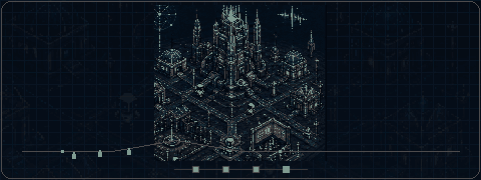
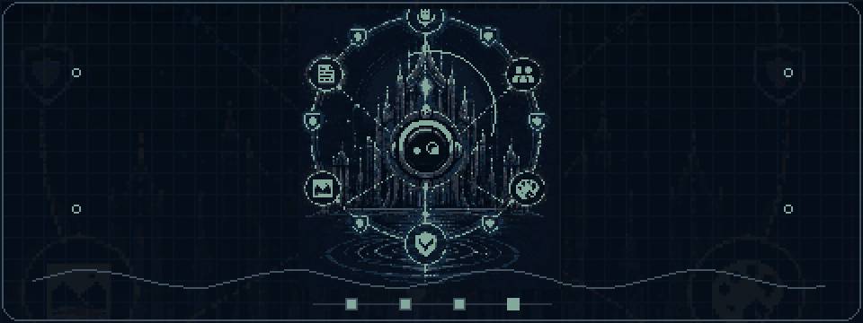
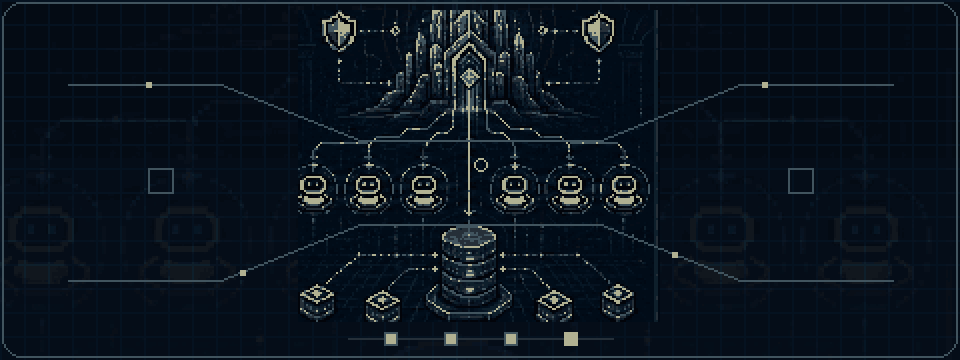
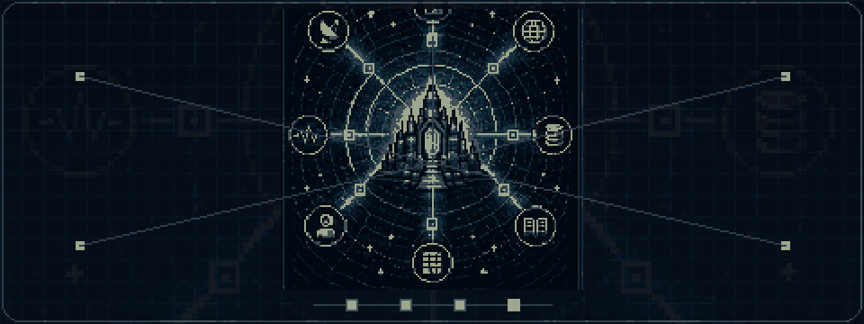
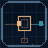
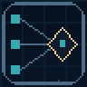
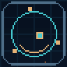
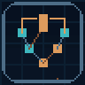
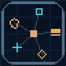

  <picture>
    <source media="(max-width: 600px)" srcset="./assets/profile-banner-mobile.svg" />
    
  </picture>

<h1 align="center">Cameron Marriott</h1>

<strong>Independent AI systems developer</strong>

  I build deterministic, inspectable agent systems for conversation, coordination, research, and emergent worlds.

  <a href="#what-im-building">Explore the systems</a> ·
  <a href="https://github.com/Konfusi0n/Konfusi0n/discussions">Start a public discussion</a>

## What I’m building

### Agent Sandbox

**Emergent worlds.** A deterministic living world where agents turn pressure, experimentation, memory, and culture into civilizational change.

<picture>
  <source media="(prefers-reduced-motion: reduce)" srcset="./assets/animations/agent-sandbox-poster.png" />
  
</picture>

_Current focus: emergent materials, skills, institutions, visible labor, and construction._ · [View static poster](./assets/animations/agent-sandbox-poster.png)

### Mira

**Conversation.** A Discord-native AI operations room for voice, research, memory, and multimodal collaboration.

<picture>
  <source media="(prefers-reduced-motion: reduce)" srcset="./assets/animations/mira-poster.png" />
  
</picture>

_Current focus: live voice, evidence trails, trust receipts, creative tools, and operator control._ · [View static poster](./assets/animations/mira-poster.png)

### Automata

**Coordination.** An orchestration system for supervising coding agents with bounded authority and durable architectural context.

<picture>
  <source media="(prefers-reduced-motion: reduce)" srcset="./assets/animations/automata-poster.png" />
  
</picture>

_Current focus: scoped work, evidence-backed handoffs, architecture memory, and validation loops._ · [View static poster](./assets/animations/automata-poster.png)

### Spider Sense

**Research.** An evidence-first research system that ranks sources and keeps synthesis traceable.

<picture>
  <source media="(prefers-reduced-motion: reduce)" srcset="./assets/animations/spider-sense-poster.png" />
  
</picture>

_Current focus: discovery, contradiction checks, freshness checks, and source-backed synthesis._ · [View static poster](./assets/animations/spider-sense-poster.png)

> **Agent Sandbox evolves. Mira collaborates. Automata coordinates. Spider Sense investigates.**
>
> **Portfolio scope:** All four systems are under private development. This profile shares their product direction and engineering principles; the implementation remains private.

## One design language

  <picture>
    <source media="(max-width: 600px)" srcset="./assets/system-map-mobile.svg" />
    
  </picture>

> **Models propose. Validated systems decide. Evidence remains visible.**

## Engineering principles

<table>
  <tr>
    <td width="96" align="center">
      <picture>
        <source media="(prefers-reduced-motion: reduce)" srcset="./assets/animations/principles/authority-poster.png" />
        
      </picture>
    </td>
    <td><strong>Authority is explicit</strong> Models propose; validated systems decide what changes.</td>
  </tr>
  <tr>
    <td width="96" align="center">
      <picture>
        <source media="(prefers-reduced-motion: reduce)" srcset="./assets/animations/principles/evidence-poster.png" />
        
      </picture>
    </td>
    <td><strong>Evidence stays inspectable</strong> Claims, sources, decisions, and fallbacks remain traceable.</td>
  </tr>
  <tr>
    <td width="96" align="center">
      <picture>
        <source media="(prefers-reduced-motion: reduce)" srcset="./assets/animations/principles/agency-poster.png" />
        
      </picture>
    </td>
    <td><strong>Agency stays bounded</strong> Permissions, costs, memory, and side effects are scoped.</td>
  </tr>
  <tr>
    <td width="96" align="center">
      <picture>
        <source media="(prefers-reduced-motion: reduce)" srcset="./assets/animations/principles/emergence-poster.png" />
        
      </picture>
    </td>
    <td><strong>Emergence stays composable</strong> Complexity grows from small interoperable systems.</td>
  </tr>
  <tr>
    <td width="96" align="center">
      <picture>
        <source media="(prefers-reduced-motion: reduce)" srcset="./assets/animations/principles/boundaries-poster.png" />
        
      </picture>
    </td>
    <td><strong>Knowledge boundaries stay clear</strong> Simulation, memory, inference, generation, and verification remain distinguishable.</td>
  </tr>
</table>

## Building now

My current focus is **Agent Sandbox**: agents that observe pressure, experiment, remember, teach, coordinate, and turn repeated behavior into tools, institutions, culture, and infrastructure—while authoritative state remains deterministic and inspectable.

## Working stack

**Languages:** C# · TypeScript · Python 
**Frameworks:** .NET · Godot · React 
**Platforms and systems:** Discord · multi-agent architecture · deterministic simulation · evidence pipelines

## Contact

I am open to thoughtful conversations about agent architecture, simulation, research systems, developer tooling, deterministic AI, and experimental products.

**[Start a public conversation on GitHub Discussions →](https://github.com/Konfusi0n/Konfusi0n/discussions)**

Please do not include confidential or sensitive information in a public discussion.
